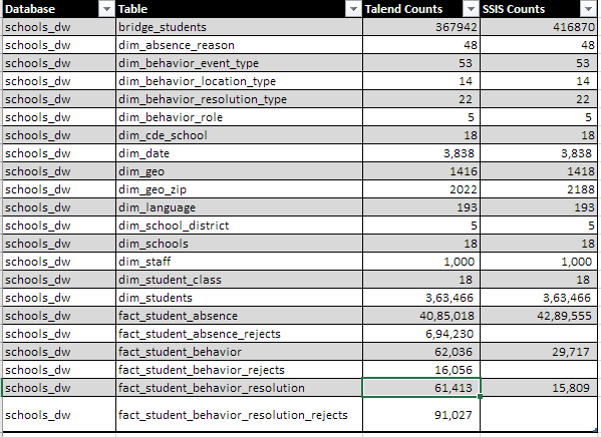
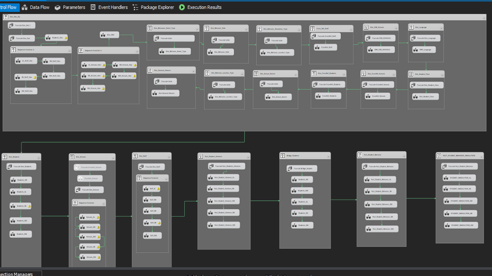
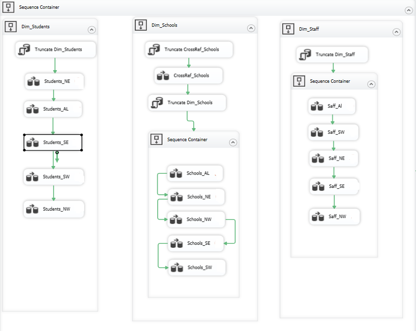
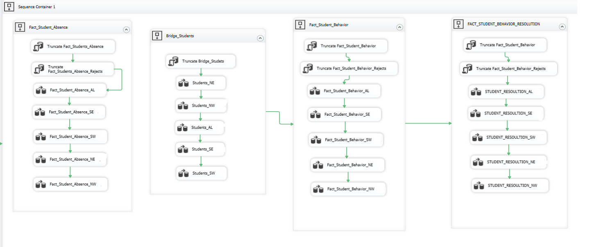
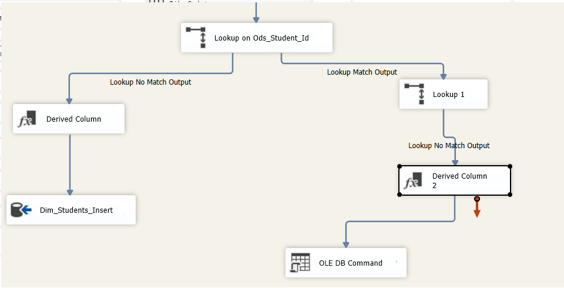
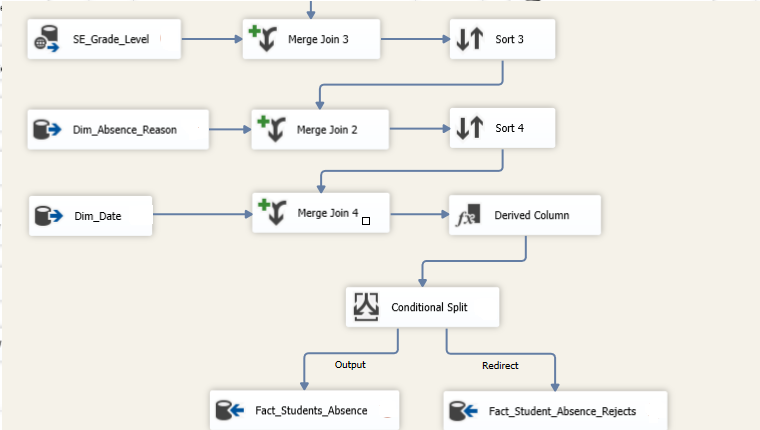

# SQL Server Integration Services(SSIS) Project:

# Overview
Performed ETL operations and transforamtions to fetch data from different sources and load to Data Warehouse (Fact and Dimension tables) in SQL Server using SSIS.

# Data Volume

# High Level Control Flow

# Containers Used
Implemente Sequence containers in the control flow for the following reasons:

1) To make workflow managable
2) Enable parallelization
3) Troubleshoot errors

# 1) Dimension Container:

# 2) Fact Container:

# Lookup Usage
Used LookUp transformatiob to check if the source data is already present in the target table. 
If Yes then ignore the rows
Else insert the record.

# Recording Errors 
Used Conditional split to save the error records in a different table.

# Challenges Faced
- Metadata errors between source and destination
- Parallelization between data flows 
- Error handling – (Will use conditional split)
- Updating the jobs – (had to update the entire hierarchy of merge joins)
- Memory distribution for parallel jobs

